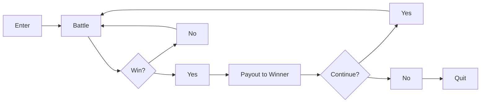
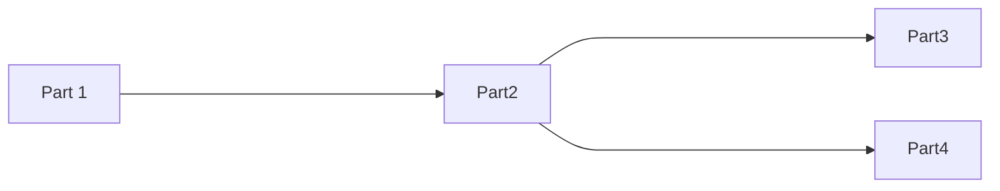

# My Awesome Adventure
Published by Publishing Company
Developed by Software Company

Revision Version: X.X

## Document History 

|Version|Date|Summary|Author|
|--|--|--|--|
|0.01|2021.13.04|Initial draft|Steven Mosley

## Table of Contents
[Document History](#document-history)  
[Game Summary](#game-summary)  
&nbsp;&nbsp;&nbsp;&nbsp;[Target Platform(s)](#target-platforms)  
&nbsp;&nbsp;&nbsp;&nbsp;[Business Model](#bussness-model)  
[Game Overview](#game-overview)  
&nbsp;&nbsp;&nbsp;&nbsp;[Theme / Setting / Genre](#theme-setting-genre)  
&nbsp;&nbsp;&nbsp;&nbsp;[Core Gameplay Mechanics](#core-gameplay-mechanics)  
&nbsp;&nbsp;&nbsp;&nbsp;[Server / Online Mechanics](#server-online-mechanics)  
&nbsp;&nbsp;&nbsp;&nbsp;[Push Notifications](#push-notifications)  
[Story and Gameplay](#story-and-gameplay)  
&nbsp;&nbsp;&nbsp;&nbsp;[Story](#story)  
&nbsp;&nbsp;&nbsp;&nbsp;[Core Gameplay](#core-gameplay)  
&nbsp;&nbsp;&nbsp;&nbsp;[Meta-Games](#meta-games)  
[User Interface / Screens](#user-interface-screens)  
&nbsp;&nbsp;&nbsp;&nbsp;[Main Menu](#main-menu)  
&nbsp;&nbsp;&nbsp;&nbsp;[Options](#options)  
&nbsp;&nbsp;&nbsp;&nbsp;[Game Screen/HUD](#game-screen-hud)  
[Levels](#levels)  
[Level Design Tools](#level-design-tools)  
[First Time Experience](#first-time-experience)  
[Economy](#economy)  
[Asset List](#asset-list)  
[Associated Documents](#associated-documents)  

## Game Summary 
A high level overview of your product. Bullet points should be used to outline some key features.

 - Feature
 - Another Feature
 - Amazing feature

### Target Platform(s) 
Provide a high level description of platform availability. Below in bullet points, provide some quick highlights for that specific version.

- Android
- iOS
	- Includes support for iCloud
- iPad OS
	- Features additional landscape mode
- Windows
	- Available on Steam
		- Features Steam Cloud saves

### Business Model 
Include any business model your product may fllow. For instance, will there be ads, will it include IAP, will it be freemium or completely free?

- Free to Play without IAP and Advertisements

## Game Overview 
### Theme/Setting/Genre 
Provide some pictures that depict the theme and setting of the game, as well as a high level description of the intended setting. Additionally, provide a high level description of the targeted genre.  

- Pic 1
- Pic 2
- Pic 3

### Core Gameplay Mechanics 
Include an overview of core gameplay mechanics to be included. Movement, combat, inventory, questing, abilities, etc.

### Server/Online Mechanics 
Include an overview of any server side or online mechanics the game may use. Does it support online play? How does the client <-> server communicate?

* Cloud Save with online creation
* Friend leaderboards
* Co-op with 1 other player

### Push Notifications 
Provide an overview of push notifications to be included (if any).

## Story and Gameplay 
### Story 
Go into detail of the story and how the story will be presented to the player. Will there be cutscenes? Will there be talking heads? Will there be both?

### Core Gameplay 
Description of how the game loop will work, with flowcharts.

### Meta-Games 
Variables or systems that work such as upgrading characters, inventory systems, questing systems, etc. Include flowcharts that show how they work similarly to the game loop from the [Core Gameplay](#core-gameplay)  section.

## User Interface / Screens 
This is where every UI element will be outlined. Perhaps not to exact detail, but a general overview of the layout. Main screen, HUD, options menu, etc. Rough sketches with pen/pencil and paper may be easier and quicker and will convey the idea just as well as a digital representation.

### Main Menu
Lay out each element on the screen, with a umbered legend to easily distinguish what is what.

### Options
Lay out each element on the screen, with a umbered legend to easily distinguish what is what.

### Game Screen/HUD
Lay out each element on the screen, with a umbered legend to easily distinguish what is what.

## Levels
Lay out the levels. Names, description of how they will be themed, difficulty -- as much information as can be provided. A graph that also shows how the levels ramp up in difficulty is also helpful.

## Level Design Tools

## First Time Experience

## Economy

## Asset List
-   Art
    -   Note if 2D or 3D
    -   If 3D Details on Textures and Poly Count
-   Environment Art
    -   All Associated Animations
-   UI - Icons, Buttons, Pop Ups
-   Game Objects
    -   Buildings
    -   Characters
    -   Weapons
    -   Tools
    -   All Associated Animations
-   Particle FX
-   Sound Effects
-   Music
-   All Writing
    -   Quest Scripts
    -   Story Screenplay
-   Level Design Documents

## Associated Documents [To Be Modified]  
This list is not set in stone. A lot of these items do not apply to all games, and certainly do not apply to solo Indie developers.

- Full Asset List (Spreadsheet)
- Full Economy / System Design (Spreadsheet)
- Technical Design Document (TDD)
    - All Tools Used
    - Architecture Decisions
    - Cloud Hosting
    - Etc.
- Creative Design Document (CDD)
    - Mood Boards
    - Etc.
- Schedule (Spreadsheet)
    - A list of all milestones
    - What is in the milestone
    - Team to accomplish the milestone
    - Delivery date
- Budget (Spreadsheet)
    - IP / Brand License Costs
    - Software License Costs
    - Hardware Costs
    - Hosting Costs
    - Team Costs 
        - Total
        - And Per Milestone
    - Marketing Costs
